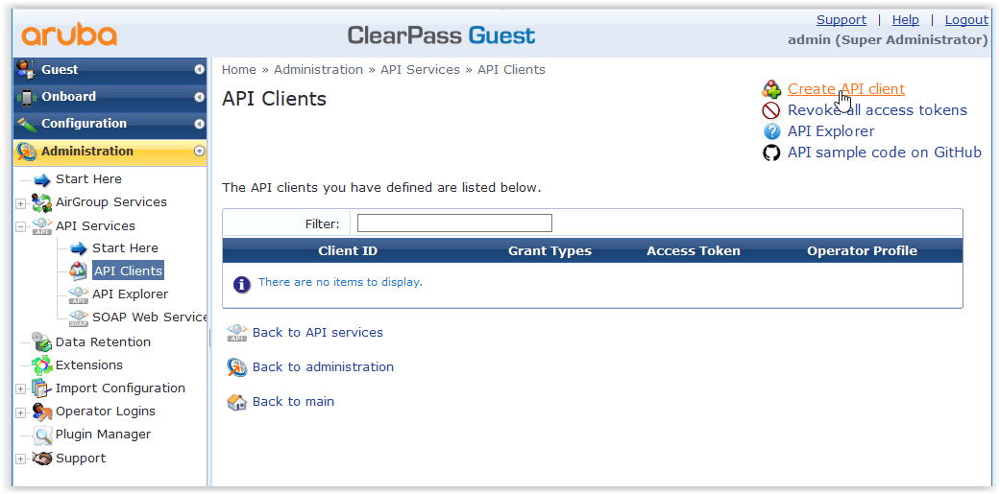
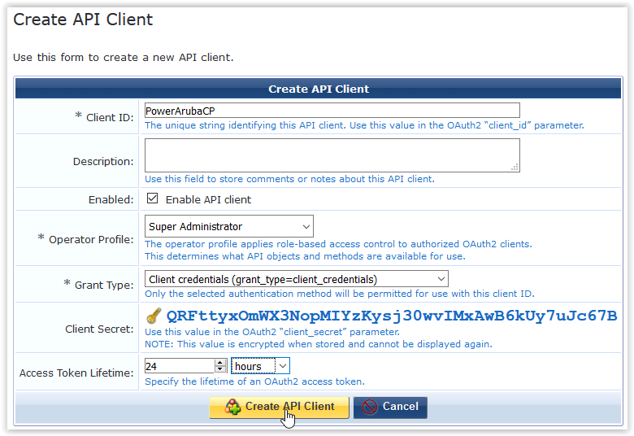
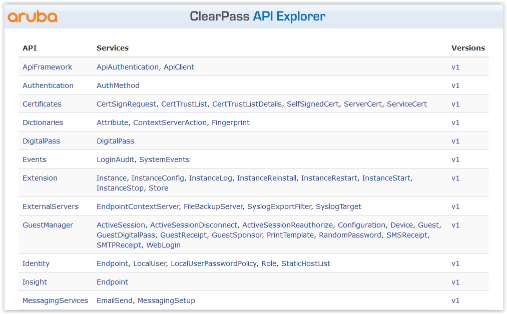
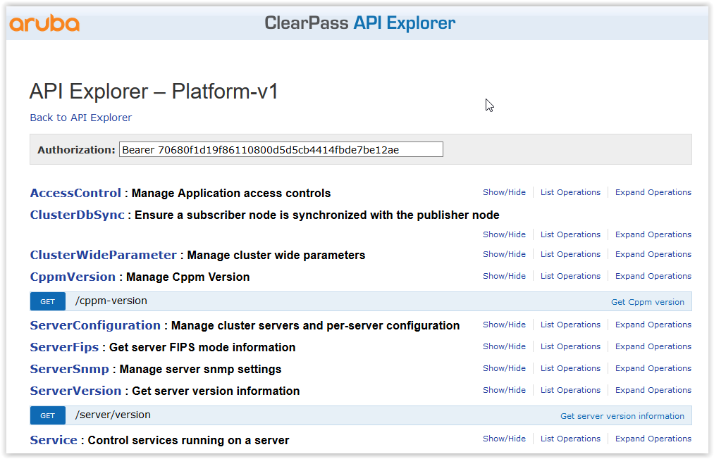

# PowerArubaCP

This is a Powershell module for configure a Aruba ClearPass (CPPM).

With this module (version 0.2.0) you can manage:

- Network Device (Add / Get / Set / Remove a NAS)
- Invoke API using Invoke-ArubaCPRestMethod

More functionality will be added later.

Tested with Aruba ClearPass (using release 6.7.x and 6.8.x)

# Usage

All resource management functions are available with the Powershell verbs GET, ADD, SET, REMOVE. 
For example, you can manage NAS (NetworkDevice) with the following commands:
- `Get-ArubaCPNetworkDevice`
- `Add-ArubaCPNetworkDevice`
- `Set-ArubaCPNetworkDevice`
- `Remove-ArubaCPNetworkDevice`

# Requirements

- Powershell 5 or 6 (Core) (If possible get the latest version)
- A ClearPass (with release >= 6.7.x) and API Client enable

# Instructions
### Install the module
```powershell
# Automated installation (Powershell 5 and later):
    Install-Module PowerArubaCP

# Import the module
    Import-Module PowerArubaCP

# Get commands in the module
    Get-Command -Module PowerArubaCP

# Get help
    Get-Help Add-ArubaCPArubaNetwork -Full
```

# Examples

### Connecting to the ClearPass using API

The first thing to do is to get API Client Token

Go on WebGUI of your ClearPass, on Guest Modules
  
Go on `Administration` => `API Services` => `API Clients`

  
Create a `New API Client`
- Client ID : a client name (for example PowerArubaCP)
- Operator Profile : Super Administrator
- Grant type : Client credentials
- Access Token Lifetime : You can increment ! (24 hours !)

Click on `Create API Client` (you don't need to store the Client Secet)

On `API Clients List`, select the your client
  

Click on `Generate Access Token`

  
And kept the token (for example : 70680f1d19f86110800d5d5cb4414fbde7be12ae)


After connect to a Aruba ClearPass with the command `Connect-ArubaCP` :

```powershell
# Connect to the Aruba Clearpass
    Connect-ArubaCP 192.0.2.1 -token 70680f1d19f86110800d5d5cb4414fbde7be12ae

```

### Invoke API
for example to get ClearPass version

```powershell
# get ClearPass version using API
    Invoke-ArubaCPRestMethod -method "get" -uri "api/cppm-version"

    app_major_version   : 6
    app_minor_version   : 7
    app_service_release : 2
    app_build_number    : 105008
    hardware_version    : CLABV
    fips_enabled        : False
    eval_license        : False
    cloud_mode          : False
```

if you get a warning about `Unable to connect` Look [Issue](#Issue)

to get API uri, go to ClearPass Swagger (https://CPPM-IP/api-docs)
  

And choice a service (for example Platform)
  

### NAS Management

You can create a new NAS `Add-ArubaCPNetworkDevice`, retrieve its information `Get-ArubaCPNetworkDevice`, modify its properties `Set-ArubaCPNetworkDevice`, or delete it `Remove-ArubaCPNetwork`.

```powershell
# Create a NAS
    Add-ArubaCPNetworkDevice -name SW1 -ip_address 192.0.2.1 -radius_secret MySecurePassword -vendor Aruba -description "Add by PowerArubaCP"

    id            : 3004
    name          : SW1
    description   : Add by PowerArubaCP
    ip_address    : 192.0.2.1
    radius_secret :
    tacacs_secret :
    vendor_name   : Aruba
    coa_capable   : False
    coa_port      : 3799
    attributes    :
    _links        : @{self=}


# Get information about NAS
    Get-ArubaCPNetworkDevice -name SW1 | Format-Table

    id   name description         ip_address radius_secret tacacs_secret vendor_name coa_capable coa_port attributes
    --   ---- -----------         ---------- ------------- ------------- ----------- ----------- -------- ----------
    3004 SW1  Add by PowerArubaCP 192.0.2.1                              Aruba       False       3799

# (Re)Configure NAS
    Get-ArubaCPNetworkDevice -name SW1 | Set-ArubaCPNetworkDevice  -ip_address 192.0.2.2 -vendor_name Hewlett-Packard-Enterprise

    id            : 3004
    name          : SW1
    description   :
    ip_address    : 192.0.2.2
    radius_secret :
    tacacs_secret :
    vendor_name   : Hewlett-Packard-Enterprise
    coa_capable   : True
    coa_port      : 3799
    attributes    :
    _links        : @{self=}

# Remove a NAS
    $nad = Get-ArubaCPNetworkDevice -name SW1
    $nad | Remove-ArubaCPNetworkDevice -noconfirm
```
### Filtering
For `Invoke-ArubaCPRestMethod`, it is possible to use -filter parameter
You need to use ClearPass API syntax :

|Description |	JSON Filter Syntax |
| ---------- | ------------------- |
| No filter, matches everything | {} |
| Field is equal to "value" | {"fieldName":"value"} or {"fieldName":{"$eq":"value"}} |
| Field is one of a list of values | {"fieldName":["value1", "value2"]}  or {"fieldName":{"$in":["value1", "value2"]}} |
| Field is not one of a list of values | {"fieldName":{"$nin":["value1", "value2"]}} |
| Field contains a substring "value" | {"fieldName":{"$contains":"value"}} |
| Field is not equal to "value" | {"fieldName":{"$ne":"value"}} |
| Field is greater than "value" | {"fieldName":{"$gt":"value"}} |
| Field is greater than or equal to "value" | {"fieldName":{"$gte":"value"}} |
| Field is less than "value" | {"fieldName":{"$lt":"value"}} |
| Field is less than or equal to "value" | {"fieldName":{"$lte":"value"}} |
| Field matches a regular expression (case-sensitive) | {"fieldName":{"$regex":"regex"}} |
| Field matches a regular expression (case-insensitive) | {"fieldName":{"$regex":"regex", "$options":"i"}} |
| Field exists (does not contain a null value) | {"fieldName":{"$exists":true}} |
| Field is NULL | {"fieldName":{"$exists":false}} |
| Combining filter expressions with AND | {"$and":[ filter1, filter2, ... ]} |
| Combining filter expressions with OR | {"$or":[ filter1, filter2, ... ]} |
| Inverting a filter expression | {"$not":{ filter }} |
| Field is greater than or equal to 2 and less than 5 | {"fieldName":{"$gte":2, "$lt":5}} {"$and":[ {"fieldName":{"$gte":2}}, {"fieldName":{"$lt":5}} ]}

For `Get-XXX` cmdlet like `Get-ArubaCPNetwork`, it is possible to using some helper filter (`-filter_attribute`, `-filter_type`, `-filter_value`)

```powershell
# Get NetworkDevice named NAD-PowerArubaCP
    Get-ArubaCPNetworkDevice -name NAD-PowerArubaCP
...

# Get NetworkDevice contains NAD-PowerArubaCP
    Get-ArubaCPNetworkDevice -name NAD-PowerArubaCP -filter_type contains
...

# Get NetworkDevice where ip_address equal 192.168.1.1
    Get-ArubaCPNetworkDevice -filter_attribute ip_address -filter_type equal -filter_value 192.168.1.1
...

```
Actually, support only `equal` and `contains` filter type

### Disconnecting

```powershell
# Disconnect from the Aruba ClearPass
    Disconnect-ArubaCP
```

# Issue

## Unable to connect (certificate)
if you use `Connect-ArubaCP` and get `Unable to Connect (certificate)`

The issue coming from use Self-Signed or Expired Certificate for switch management

Try to connect using `Connect-ArubaCP -SkipCertificateCheck`

# List of available command
```powershell
Add-ArubaCPNetworkDevice
Confirm-ArubaCPNetworkDevice
Connect-ArubaCP
Disconnect-ArubaCP
Get-ArubaCPNetworkDevice
Invoke-ArubaCPRestMethod
Remove-ArubaCPNetworkDevice
Set-ArubaCPCipherSSL
Set-ArubaCPNetworkDevice
Set-ArubaCPuntrustedSSL
Show-ArubaCPException
```

# Author

**Alexis La Goutte**
- <https://github.com/alagoutte>
- <https://twitter.com/alagoutte>

# Special Thanks

- Warren F. for his [blog post](http://ramblingcookiemonster.github.io/Building-A-PowerShell-Module/) 'Building a Powershell module'
- Erwan Quelin for help about Powershell

# License

Copyright 2018 Alexis La Goutte and the community.
